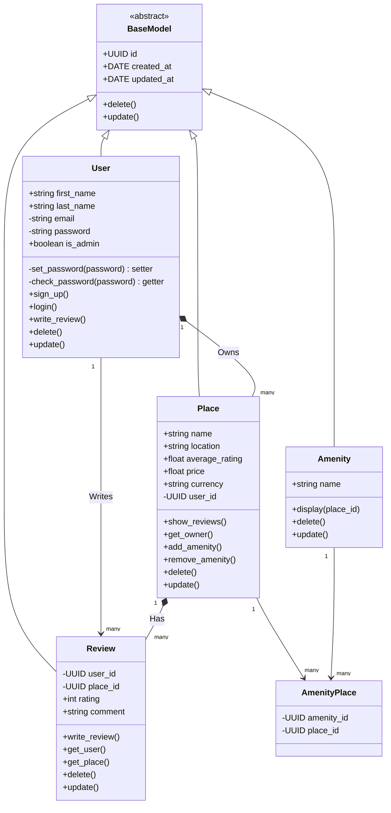

The ClassDiagram of our HBNB project : 

```mermaid
classDiagram
  class BaseModel {
    <<abstract>>
    +UUID id
    +DATE created_at
    +DATE updated_at
    +delete()
    +update()
  }

  class User {
    +string first_name
    +string last_name
    -string email
    -string password
    +boolean is_admin
    -set_password(password)setter
    -check_password(password)getter
    +sign_up()
    +login()
    +write_review()
    +delete()
    +update()
  }

  class Place {
    +string name
    +string location
    +float average_rating
    +float price
    +string currency
    -UUID user_id
    +show_reviews()
    +get_owner()
    +add_amenity()
    +remove_amenity()
    +delete()
    +update()
  }

  class Review {
    -UUID user_id
    -UUID place_id
    +int rating
    +string comment
    +write_review()
    +get_user()
    +get_place()
    +delete()
    +update()
  }

  class Amenity {
    +string name
    +display(place_id)
    +delete()
    +update()
  }

  class AmenityPlace {
    -UUID amenity_id
    -UUID place_id
  }

BaseModel <|-- User
BaseModel <|-- Place
BaseModel <|-- Amenity
BaseModel <|-- Review

Place "1" --> "many" AmenityPlace
Amenity "1" --> "many" AmenityPlace
User "1" --> "many" Review : Writes
User "1" *-- "many" Place : Owns
Place "1" *-- "many" Review : Has
```
