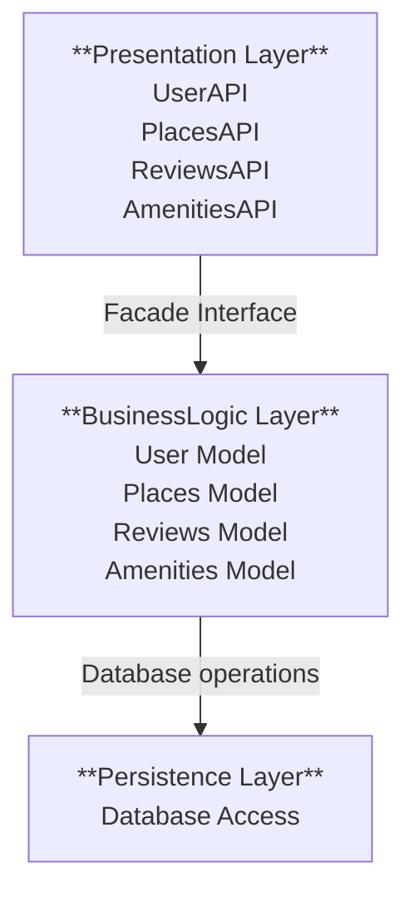
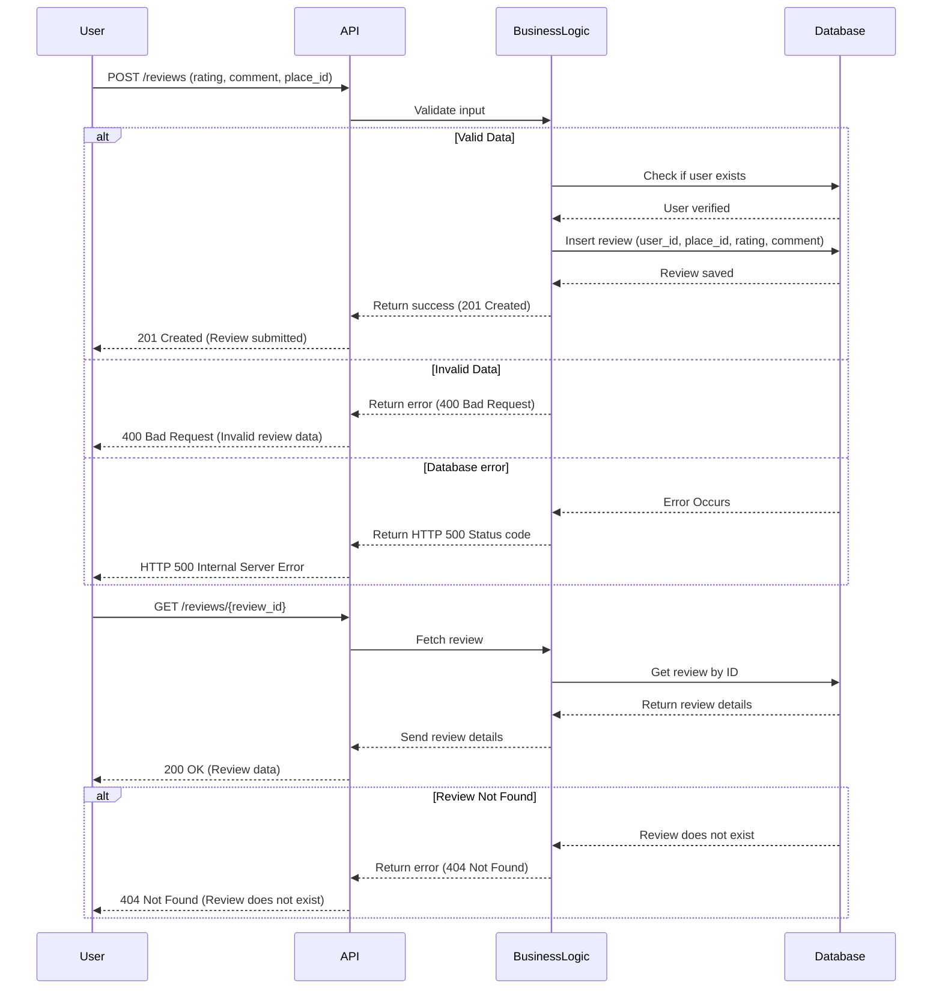
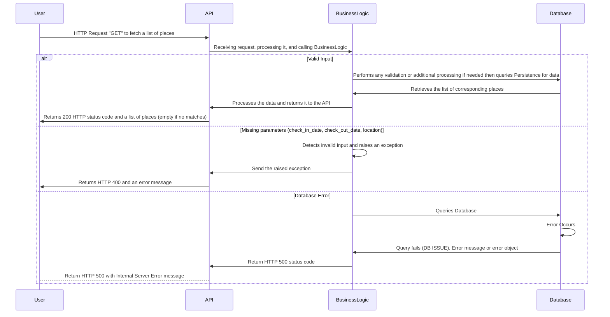

# HBNB

## Introduction
HBNB is a minimalist Airbnb-like platform that allows users to list and explore rental properties. Currently, it does not include a payment system or booking functionality, but it will provide a solid foundation for managing places, users, and related data.  

This document outlines the UML diagrams used in the project's conception, explaining their significance and how they shape the architecture of HBNB.  

---

## 📌 Comprehensive Technical Document

## 1️⃣ **Introduction**
**Overview:**  
This document serves as a technical reference for the HBNB project, detailing its architectural design, business logic, and API interaction flow. It ensures clarity and consistency in implementation and provides guidance for future development.  

---

## 2️⃣ **High-Level Architecture**

### High-Level Architecture  

The **High-Level Package Diagram** of HBNB represents the architecture in **three main layers**:  

#### 1️⃣ Presentation Layer (Services, API)  
- Manages interaction with users through controllers and API services.  
- Validates and forwards requests to the business logic layer via a **facade**.  

#### 2️⃣ Business Logic Layer (Models & Logic)  
- Contains the **core models** of the project (`User`, `Place`, `Review`, `Amenity`).  
- Implements **business logic** (entity management and validation).  
- Uses the **Facade Pattern** to centralize service access.  

#### 3️⃣ Persistence Layer (Database & Repositories)  
- Responsible for **data management and persistence**.  
- Provides **repositories** to interact with the database.  

#### 🔄 Communication Between Layers  
- **Requests always go through the facade** to prevent direct coupling between presentation and persistence.  
- The architecture promotes **modularity**, **scalability**, and **better maintainability** of the code.  




---

## 2️⃣Class Diagram  

The **Class Diagram** of our HBNB project represents the **core entities** and their relationships, ensuring a clear **object-oriented structure** for managing users, places, reviews, and amenities.  

### 📌 **Main Classes & Inheritance**  
- **`BaseModel`** (Abstract Class)  
  - Serves as a **parent class** for all other models, providing common attributes (`id`, `created_at`, `updated_at`) and generic methods (`delete()`, `update()`).  

- **`User`**  
  - Represents a platform user, storing **personal details** (`first_name`, `last_name`, `email`, `password`).  
  - Implements authentication (`set_password()`, `check_password()`, `sign_up()`, `login()`).  
  - Users can **write reviews** and **own places**.  

- **`Place`**  
  - Represents a rental property with details like **name, location, price, currency, and average rating**.  
  - Each place is **owned by a user** (`owner_id`).  
  - Supports amenities (`add_amenity()`, `remove_amenity()`).  

- **`Review`**  
  - Allows users to leave a **rating and comment** on a place.  
  - Connected to both a `User` (who writes the review) and a `Place` (being reviewed).  

- **`Amenity`**  
  - Represents an individual amenity (e.g., Wi-Fi, Pool).  
  - Can be **linked to multiple places** through `AmenityPlace`.  

#### 🔄 **Relationships Between Classes**  
- **Inheritance (`<|--`)**  
  - `User`, `Place`, `Review`, and `Amenity` all **inherit from `BaseModel`**, ensuring common functionalities.  

- **Associations (`-->`, `*--`)**  
  - A `User` **owns multiple places** (`1 *-- many`).  
  - A `User` **writes multiple reviews** (`1 --> many`).  
  - A `Place` **has multiple reviews** (`1 *-- many`).  
  - `Place` and `Amenity` share a **many-to-many** relationship, managed via `AmenityPlace`.  

This class diagram provides a **structured representation** of the core objects in HBNB, ensuring clear **data management and modularity** for future implementations:
 
 ```mermaid
classDiagram
  class BaseModel {
    <<abstract>>
    +UUID id
    +DATE created_at
    +DATE updated_at
    +delete()
    +update()
  }

  class User {
    +string first_name
    +string last_name
    -string email
    -string password
    +boolean is_admin
    -set_password(password)setter
    -check_password(password)getter
    +sign_up()
    +login()
    +write_review()
    +delete()
    +update()
  }

  class Place {
    +string name
    +string location
    +float average_rating
    +float price
    +string currency
    -UUID user_id
    +show_reviews()
    +get_owner()
    +add_amenity()
    +remove_amenity()
    +delete()
    +update()
  }

  class Review {
    -UUID user_id
    -UUID place_id
    +int rating
    +string comment
    +write_review()
    +get_user()
    +get_place()
    +delete()
    +update()
  }

  class Amenity {
    +string name
    +display(place_id)
    +delete()
    +update()
  }

  class AmenityPlace {
    -UUID amenity_id
    -UUID place_id
  }

BaseModel <|-- User
BaseModel <|-- Place
BaseModel <|-- Amenity
BaseModel <|-- Review

Place "1" --> "many" AmenityPlace
Amenity "1" --> "many" AmenityPlace
User "1" --> "many" Review : Writes
User "1" *-- "many" Place : Owns
Place "1" *-- "many" Review : Has
```

---


## 3️⃣API Calls & Sequence Diagrams  

The HBNB project follows a structured API interaction model, ensuring clear communication between the **Presentation Layer (API Services)**, **Business Logic Layer**, and **Persistence Layer (Database)**. Below are key sequence diagrams illustrating different API calls and their execution flow.  

---

##### 1️⃣ User Registration  

This sequence diagram shows the steps involved when a user tries to create an account. The system validates the input, hashes the password, and stores the user data in the database.  
We've added some edge cases that could be expected.
```mermaid
sequenceDiagram
    participant User
    participant API
    participant BusinessLogic
    participant Persistence

    User->>API: Send registration data (name, email, password)
    API->>BusinessLogic: Validate input data (email, password)

    alt Valid input
        BusinessLogic->>BusinessLogic: Hash password (if needed)
        BusinessLogic->>Persistence: Save user data to database
        Persistence->>BusinessLogic: Confirm user saved
        BusinessLogic->>API: Return success
        API->>User: HTTP 201 - User created successfully
        
    else Database error (HTTP 500)
        Persistence->>API: Return error (HTTP 500 - Database failure)
        API->>User: HTTP 500 - Internal Server Error
       
    else Invalid input (missing password or existing email)
        BusinessLogic->>BusinessLogic: Detects Invalid input
        BusinessLogic->>API: Return error (password required)
        API->>User: HTTP 400 + Error message
    end
  ```

---
#### 2️⃣ Creating a New Place
This sequence represents the API flow when a user creates a new place listing. The request is validated, processed, and stored in the database if successful.
```mermaid
sequenceDiagram
    participant User
    participant API
    participant BusinessLogicLayer
    participant PersistenceLayer

    User->>API: POST /places (title, description, price, lat, long, photos, amenities)
    API->>BusinessLogicLayer: validateRequest (data)
    BusinessLogicLayer->>PersistenceLayer: createPlace (data)

    alt Insert Success
        PersistenceLayer-->>BusinessLogicLayer: return new Place (id)
        BusinessLogicLayer-->>API: return Response (201, place)
        API-->>User: Response (201 Created) JSON (place)

    else Missing required fields (photos, amenities, etc.)
        BusinessLogicLayer ->> BusinessLogicLayer: Detects invalid input
        BusinessLogicLayer-->>API: return Response (400, "Missing required fields")
        API-->>User: Response (400 Bad Request) JSON (error)

    else Insert Failed
        PersistenceLayer-->>BusinessLogicLayer: return Response (500, "Database Error")
        BusinessLogicLayer-->>API: return Response (500, "Database Error")
        API-->>User: Response (500 Internal Server Error) JSON (error)
    end
```
#### 3️⃣ Submitting a Review
This sequence details how a user submits a review for a place, ensuring the user exists, storing the review, and handling potential errors.



#### 4️⃣ Fetching a List of Places
This sequence describes the process when a user requests a list of places.


## 🚀 Project Status  

This project is **currently under development** and will be implemented soon. Stay tuned for updates!  

If you have any **questions, suggestions, or feedback**, feel free to reach out. Don't hesitate to ask! 😃


