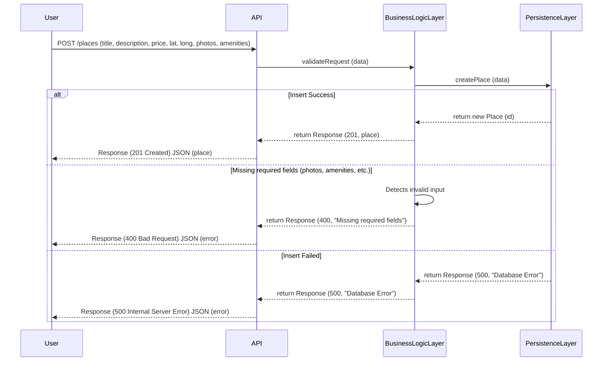

First here we have a sequence for a User registration case : 
 ```mermaid
sequenceDiagram
    participant User
    participant API
    participant BusinessLogic
    participant Persistence

    User->>API: Send registration data (name, email, password)
    API->>BusinessLogic: Validate input data (email, password)

    alt Valid input
        BusinessLogic->>BusinessLogic: Hash password (if needed)
        BusinessLogic->>Persistence: Save user data to database
        Persistence->>BusinessLogic: Confirm user saved
        BusinessLogic->>API: Return success
        API->>User: HTTP 201 - User created successfully
        
    else Database error (HTTP 500)
        Persistence->>API: Return error (HTTP 500 - Database failure)
        API->>User: HTTP 500 - Internal Server Error
       
    else Invalid input (missing password or existing email)
        BusinessLogic->>BusinessLogic: Detects Invalid input
        BusinessLogic->>API: Return error (password required)
        API->>User: HTTP 400 + Error message
    end
```

It show how the app will interact in a case where a user is trying to create an account

The following case is about Place creation : 


Next Diagram is about the Review Submission : A user tries to submit a review to a place
